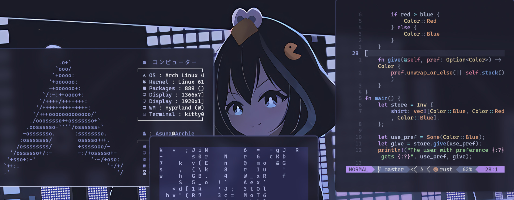

# Dotfiles

Modified [Hyde](https://github.com/Hyde-project/hyde) Hyprland dotfiles combined with my own custom configurations.

## File Types

- **cava/**
- **dunst/**
- **fastfetch/**
- **hypr/**
- **kitty/**
- **rofi/**
- **swaylock/**
- **waybar/**
- **wlogout/**
- **yazi/**
- **.bashrc**
- **.tmux.conf**
- **.vimrc**
- **.zshrc**
- **dolphinrc**
- **[neovim](https://github.com/SamTheTechi/nvimConfig)**

---

Feel free to fork and customize!
